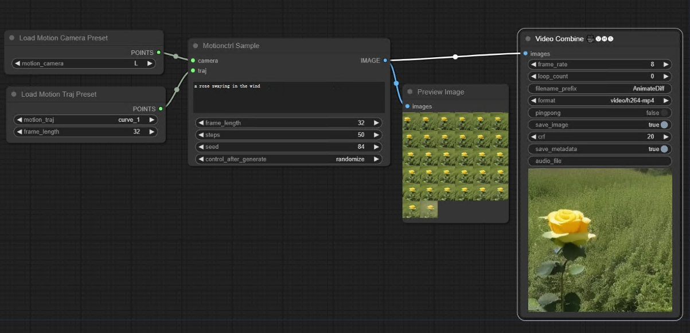
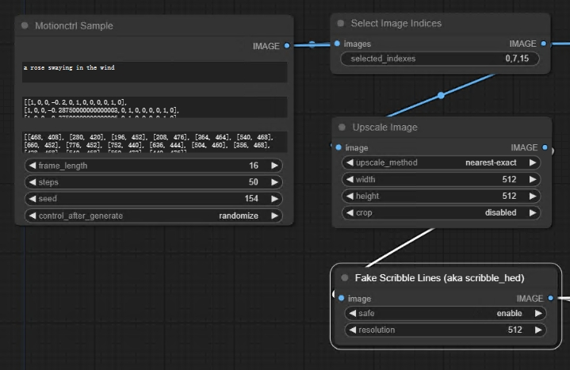

# This is an implementation of MotionCtrl for ComfyUI

[MotionCtrl](https://github.com/TencentARC/MotionCtrl): A Unified and Flexible Motion Controller for Video Generation 

## Install

1. Clone this repo into custom_nodes directory of ComfyUI location

2. Run pip install -r requirements.txt

3. Download the weights of MotionCtrl  [motionctrl.pth](https://huggingface.co/TencentARC/MotionCtrl/blob/main/motionctrl.pth) and put it to `ComfyUI/models/checkpoints`

## Nodes

Four nodes `Motionctrl Sample` & `Load Motion Camera Preset` & `Load Motion Traj Preset` & `Select Image Indices`

## Tools

[Motion Traj Tool](https://chaojie.github.io/ComfyUI-MotionCtrl/tools/draw.html) Generate motion trajectories

## Examples

base workflow

https://github.com/chaojie/ComfyUI-MotionCtrl/blob/main/workflow_threenodes.json

unofficial implementation "MotionCtrl deployed on AnimateDiff" workflow:

https://github.com/chaojie/ComfyUI-MotionCtrl/blob/main/workflow_motionctrl.json

1. Generate LVDM/VideoCrafter Video
2. Select Images->Scribble
3. Use AnimateDiff Scribble SparseCtrl
